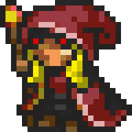

<title>KeeperRL | Official commnunity wiki</title>

 
<h1 align="center">Welcome</h1>
 
<h3 align="center">

[http://keeperrl.com/ KeeerRL Main Site][https://keeperrl.com/category/News/ Official development news.] [http://steamcommunity.com/app/329970 KeeperRL gaming community on Steam][https://discord.gg/XZfCCs5 Live Discord chat for KeeperRL] [http://keeperrl.com/Forum Official discussion forum][https://www.reddit.com/r/Keeperrl Karma points for KeeperRL on Reddit] [https://www.facebook.com/keeperrl KeeperRL friend network on Facebook][https://twitter.com/keeperRL KeeperRL gossip on Twitter] [http://www.roguebasin.com/index.php?title=KeeperRL KeeperRL RogueBasin Home] Latest popular feature (Alpha 31) October 2020: [https://steamcommunity.com/games/329970/announcements/detail/2907595185824499748 Warlord Mode]

</h3>

 

| Gameplay                                                                      
-----------------------------------------------------------------------------------------------------|
| -   [Quick Start Walkthrough for Keepers](/keeperrl_wiki/Quick_Start_Walkthrough "wikilink") 
                                                                                
 \* \[\[How to win as an adventurer                                             | !\]\]                                                                                               
                                                                                                       
  -   [Campaign mode vs Single Map](/keeperrl_wiki/Campaign_mode "wikilink")                                          
  -   [Endless Mode](/keeperrl_wiki/Endless_Mode "wikilink")                                                          
  -   [YouTube Videos](/keeperrl_wiki/YouTube_Videos "wikilink")                                                      
  -   [Shortcut Keys](/keeperrl_wiki/Shortcut_Keys "wikilink")                                                        
  -   [Player ideas, requests and contributions](/keeperrl_wiki/Player_ideas,_requests_and_contributions "wikilink")  
  -   [Source Code](http://github.com/miki151/keeperrl)                                                
  -   [Modding Guide](/keeperrl_wiki/Modding_guide "wikilink") (Alpha 26 onwards)                                     
  -   [Download Mods](/keeperrl_wiki/Download_Mods "wikilink") (Alpha 26 onwards)                                     
  -   [FAQ](/keeperrl_wiki/FAQ "wikilink")                                                                            |
| Important Concepts                                                            | Other                                                                                               |
| -   [ Full List Of Creatures](/keeperrl_wiki/Category%3A_Creatures "wikilink")               
     -   [ Keepers](/keeperrl_wiki/Keeper "wikilink")                                          
     -   [ Adventurers](/keeperrl_wiki/Adventurer "wikilink")                                  
 -   [Prisoner guide](/keeperrl_wiki/Prisoner_guide "wikilink")                                
 -   Creature natures                                                           
     -   [ Skills](:Skills "wikilink")                                          
     -   [ Traits](:Traits "wikilink")                                          
     -   [ Characteristics](:Characteristics "wikilink")                        
     -   [ Spells](:Spells "wikilink")                                          
     -   [ Attributes ](:Attributes "wikilink")                                 
     -   [ Experience ](:Experience "wikilink")                                 | -   [ Dungeon Technologies](:Technologies "wikilink")                                               
  -   [ Resources](:Resources "wikilink")                                                              
  -   [Constructions](/keeperrl_wiki/Constructions "wikilink")                                                        
      -   [ Rooms](/keeperrl_wiki/Category%3A_Rooms "wikilink")                                                       
      -   [Structures and Installations](/keeperrl_wiki/Structures_and_Installations "wikilink")                      
      -   [ Traps ](:Traps "wikilink")                                                                 
  -   [ Items](/keeperrl_wiki/Category%3A_Items "wikilink")                                                           
      -   [Weapons](/keeperrl_wiki/Weapons "wikilink")                                                                
      -   [Armor](/keeperrl_wiki/Armor "wikilink")                                                                    
      -   [Jewelry](/keeperrl_wiki/Jewelry "wikilink")                                                                
      -   [Consumables](/keeperrl_wiki/Consumables "wikilink")                                                        |

